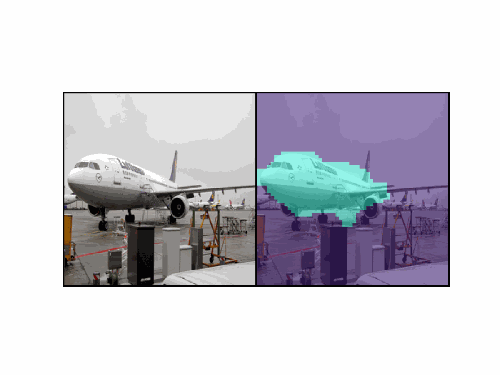
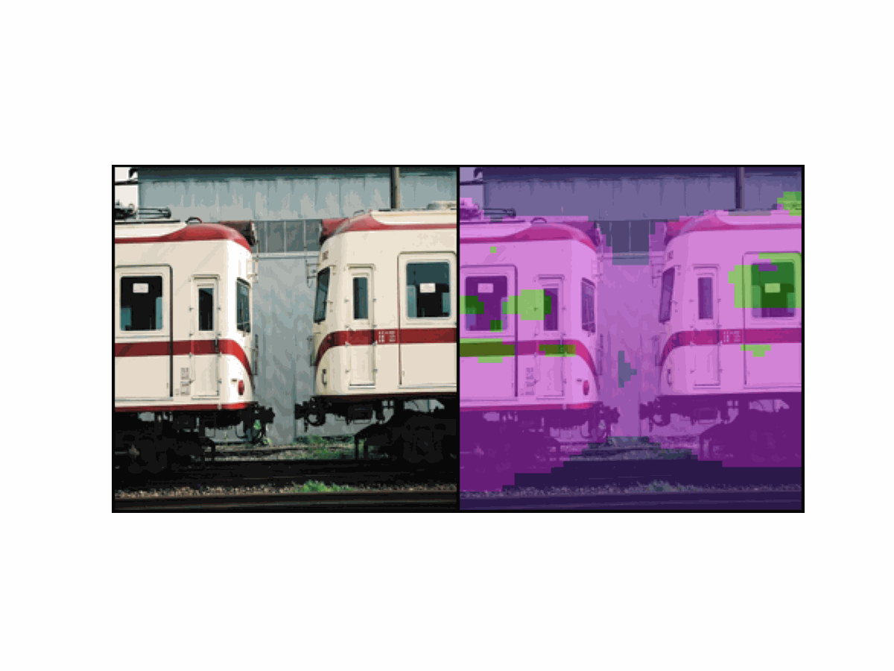
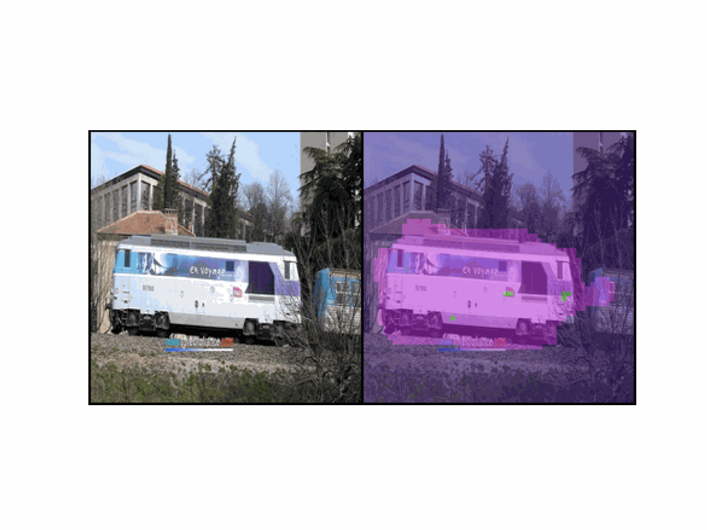
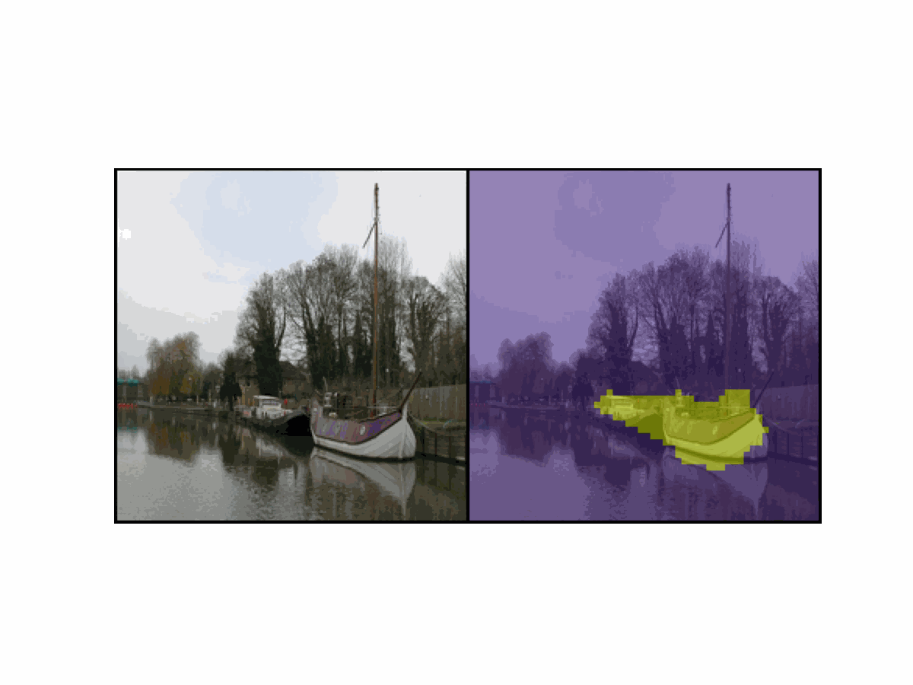
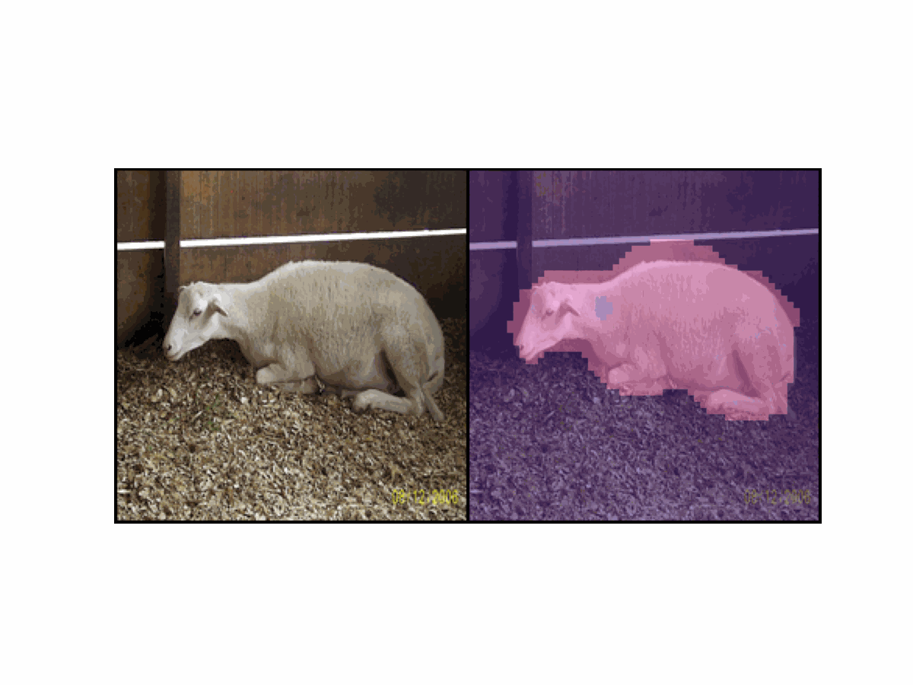
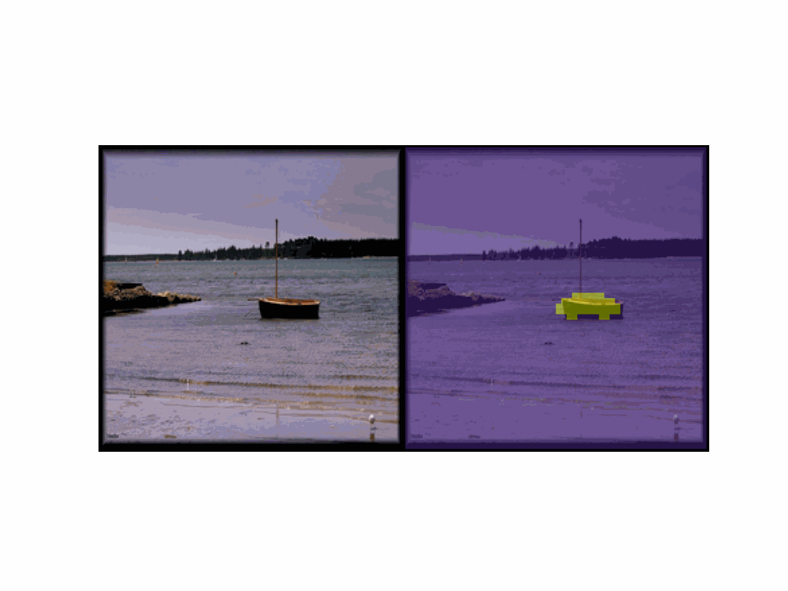
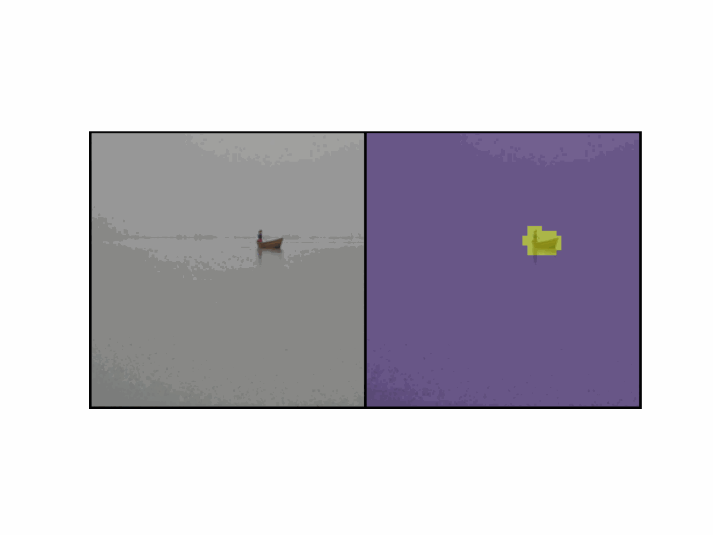
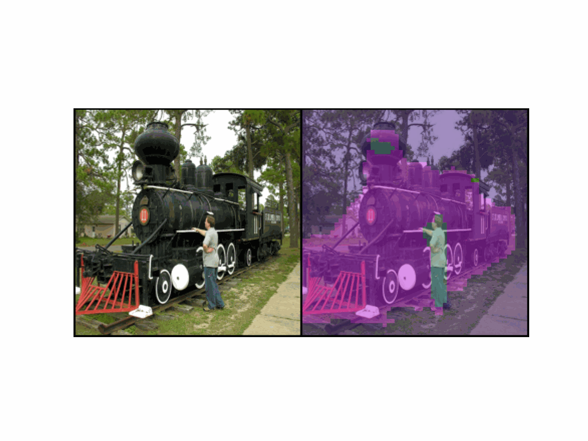
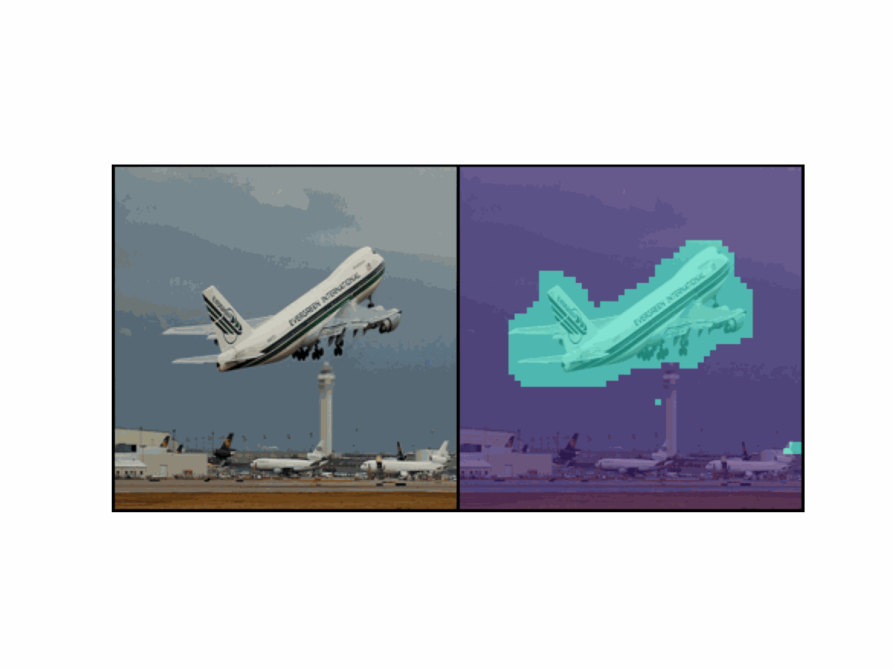
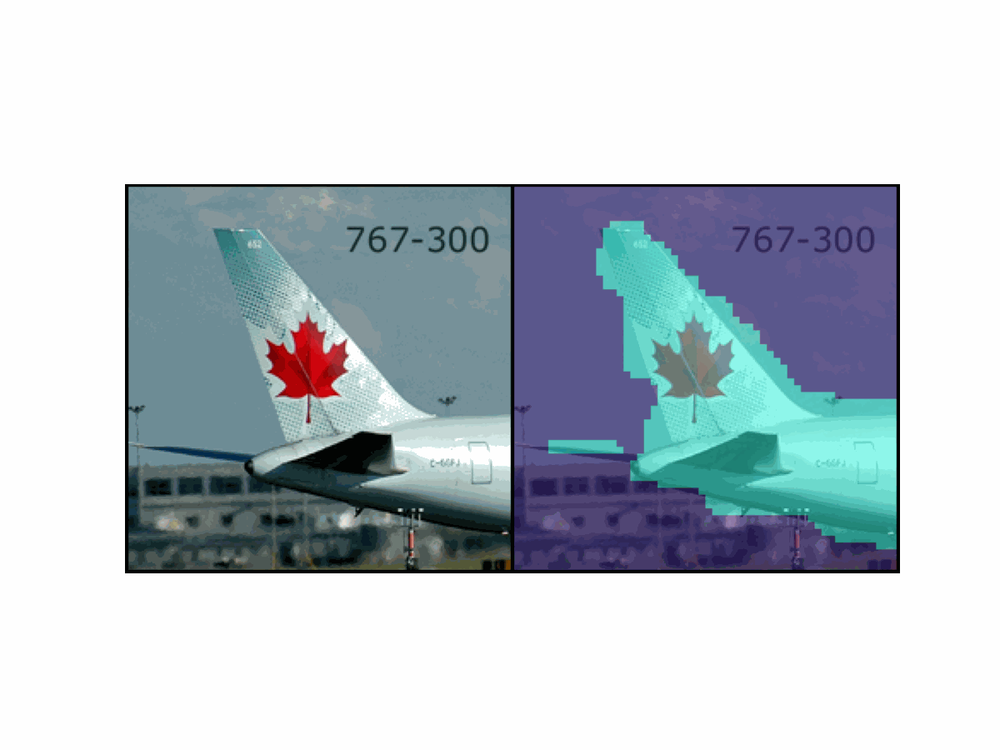

# Time Does Tell a Lot: Self-Supervised Learning of Dense Image Representations


Official PyTorch implementation and pretrained models for ***TimeT***. For details, see [arXiv](). Our pretrained model can be found [here](https://www.dropbox.com/scl/fi/nnx2mm8ian9w49vstpgz0/TimeT.pth?rlkey=w9q3hvxd51nb63ammy33qhry0&dl=0). Optimizing with our model, ***TimeT***, does not necessitate a significant GPU budget. Our training process is conducted on a single NVIDIA GeForce RTX 3090, making ***TimeT*** an effortless solution to enhance your Vision Transformer's (ViT) spatial awareness. The only prerequisite is to create videos featuring the objects that you aim to segment in your subsequent tasks. After that, simply fine-tune a pre-trained ViT using our proprietary temporal loss. 


# Dataset Structure
The structure of your dataset should follow the structure of [DAVIS](https://davischallenge.org/) (Densely Annotated VIdeo Segmentation) 2017 Unsupervised dataset.

# DAVIS Structure Example
The DAVIS dataset is organized as follows:

```
DAVIS
├── JPEGImages
│   └── 480p
│       └── object1
│           ├── 00000.jpg
│           ├── 00001.jpg
│           ├── 00002.jpg
│           └── ...
│       └── object2
│           ├── 00000.jpg
│           ├── 00001.jpg
│           ├── 00002.jpg
│           └── ...
├── Annotations
│   └── 480p
│       └── object1
│           ├── 00000.png
│           ├── 00001.png
│           ├── 00002.png
│           └── ...
│       └── object2
│           ├── 00000.png
│           ├── 00001.png
│           ├── 00002.png
│           └── ...
└── ImageSets
    └── 2017
        ├── train.txt
        ├── val.txt
        └── test-dev.txt
```

Also, the same for [YTVOS](https://youtube-vos.org/dataset/vos/):

```

YouTubeVOS
├── train
│ ├── Annotations
│ ├── JPEGImages
│ └── meta.json
└── valid
├── Annotations
├── JPEGImages
└── meta.json

```

For [Pascal VOC](https://www.dropbox.com/s/6gd4x0i9ewasymb/voc_data.zip?dl=0) in the evaluation time : 

```
dataset root.
└───SegmentationClass
│   │   *.png
│   │   ...
└───SegmentationClassAug # contains segmentation masks from trainaug extension 
│   │   *.png
│   │   ...
└───images
│   │   *.jpg
│   │   ...
└───sets
│   │   train.txt
│   │   trainaug.txt
│   │   val.txt

```

Please ensure your dataset adheres to this structure for compatibility. For datasets that deviate from the standard structure, such as [VISOR](https://epic-kitchens.github.io/VISOR/), we've included a snippet of code to manage the necessary conversion.

# Adjusting Paths in the Data Loader

You can adjust the paths of your dataset as has been set in the function `make_loader` in `data_loader.py`. To ensure accurate loading, this function should be set to point directly to the root of your dataset, specifically to the `JPEGImages` and `Annotations` for images and labels, respectively. If this path is incorrect, the dataloader will not be able to find and load your dataset correctly.

The correct configuration of this path is crucial. If the directory `JPEGImages` contains videos rather than images, the dataloader will automatically react. It generates distinct subdirectories, each named after a video, and fills these with the corresponding video frames. Moreover, the dataloader determines whether the given path is for an unconverted video dataset or a correctly converted image dataset. It does so by counting the depth of the directories it needs to traverse to reach video or image files. This counting helps it discern the type of data to handle.

Please ensure that the paths you provide are correct and accurately point to your dataset's location.


# Evaluation

1 - To replicate the results presented in the paper, you'll need to use `evaluation.py`, `linear_finetune.py`, and `cluster_based_foreground_extraction.py`.

2 - For per-dataset evaluations on Pascal VOC, certain lines should be uncommented in `evaluation.py`. These lines have been clearly indicated within the code.

3 - For video datasets, pass the `dataset_name + _val` argument to the `make_loader` function in `data_loader.py`. This will allow you to load the validation set.

Please follow these instructions to accurately reproduce our findings.

# Training

To start training from scratch, execute `time_tuning.py`. By default, the argument values are set for single GPU training without the utilization of an Exponential Moving Average (EMA) teacher, and no queue is used. However, activating these features has been observed to yield a slight performance enhancement on certain datasets, like [MOSE](https://henghuiding.github.io/MOSE/). The validation performance is logged every four epochs, while the loss is recorded with each iteration.

# Visualizations

For more visualizations please download the visualizations folder.


|    |    |    |    |
|:--:|:--:|:--:|:--:|
|   |   |  |   |
|  |  |  |  |
|   |  |  |  |
